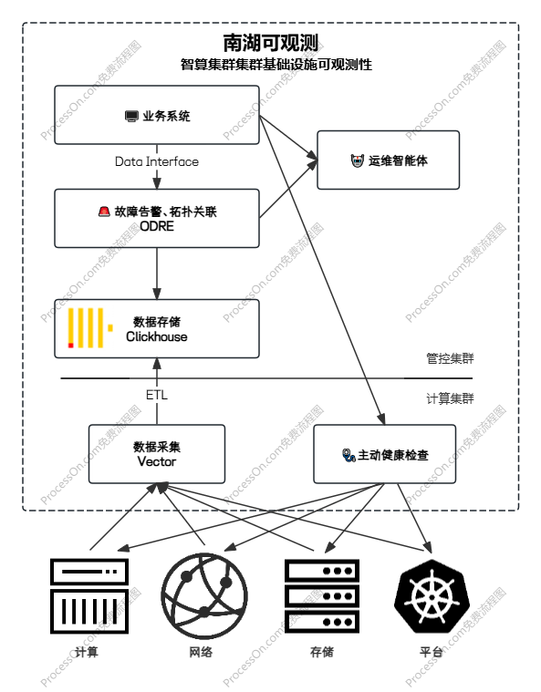

<h1 align="center" style="border-bottom: none">
    
     NanhuInsight
</h1>

NanhuInsight是一个专为<b>大规模智算集群</b>设计的<b>智能故障控制与高效运维</b>的开源项目。它提供从遥测信号采集、性能监控、故障告警、健康检查到智能故障分析与自动处置的一站式解决方案，帮助<b>降低AI训练任务中的故障影响</b>，提升集群运行稳定性与运维效率

  
<h3 align="center">
  <a href="http://pre-isg.doc.zhejianglab.org/"><b>文档</b></a> &bull;
  <a href="https://github.com/SigNoz/signoz/blob/main/README.en.md"><b>English</b></a> &bull;
</h3>

## 核心特性

### 📊 遥测数据采集

基于vector实现指标与日志的OneAgent式的高性能遥测数据管道；收集、转换和路由所有的日志、指标数据；采用混合精度采集策略，区分故障判别的核心指标与常规指标；它提供针对智算集群优化过的开箱即用的采集器，同时也兼容opentelemetry、victoria metrics servicescrape等采集协议以支持扩展。

### 🖥️ 集群监控

提供一屏化监控、下钻式拓扑可视化、历史数据回溯，支持指标、日志的检索与可视化分析，提升运维人员运维效率。

### 🚨 故障告警

当集群中发生任何异常时，会收到通知；可以针对任何类型的遥测信号（日志、指标）设置警报，创建阈值并设置通知渠道以获取通知。系统将自动对告警的严重等级、影响范围进行评估，对节点健康度进行打分；系统在k8s控制平面以crd的形式暴露集群故障诊断结果，作业平台、运维人员可基于此对故障进行半自动化的处置。

### 🩺 主动健康检查

使用日志、指标等被动式的告警难以将故障覆盖完全，且一些隐晦的故障无法通过被动式的告警检出。所以NanhuInsight项目还提供日常巡检、深度检查、训前压测等多种主动式健康检查方式，确保作业运行前无潜在隐患。

### 🤖 运维智能体

基于LLM的多智能体将会在系统的各个环节发挥效果，提供运维知识库、智能故障判定、根因分析、自动化处置，增强系统自治能力。

### 🚀 多集群统一监控

一个数据中心有时会存在多个异构的GPU集群，NanhuInsight提供联邦化的故障控制能力，并且已经适配了NVIDIA、摩尔、沐曦、昆仑芯等厂商，可以在同一个页面上获得一致的上述功能的体验，避免与厂商提供的监控系统绑定而需要学习多个监控系统。

## 软件架构

NanhuInsight 采用分布式架构设计，在管控集群和计算集群分别部署不同功能组件：

### 计算集群组件

- **Vector Agent**：部署于每个计算节点
  - 采集硬件指标
  - 收集容器和系统日志
  
- **健康检查 Agent**：负责执行健康检查任务

- **Vector Aggregator**（边缘节点）
  - 采集平台指标
  - 聚合 Vector Agent 数据
  - 转发数据至管控集群存储

- **健康检查 Executor**（边缘节点）
  - 负责健康检查任务分发

### 管控集群组件

- **ClickHouse 集群**：分布式数据存储引擎

- **ODRE 系统**
  - 数据关联分析
  - 故障告警处理

- **健康检查调度器**：统一调度健康检查任务

- **运维智能体**：实现故障自动定位与处置

  

