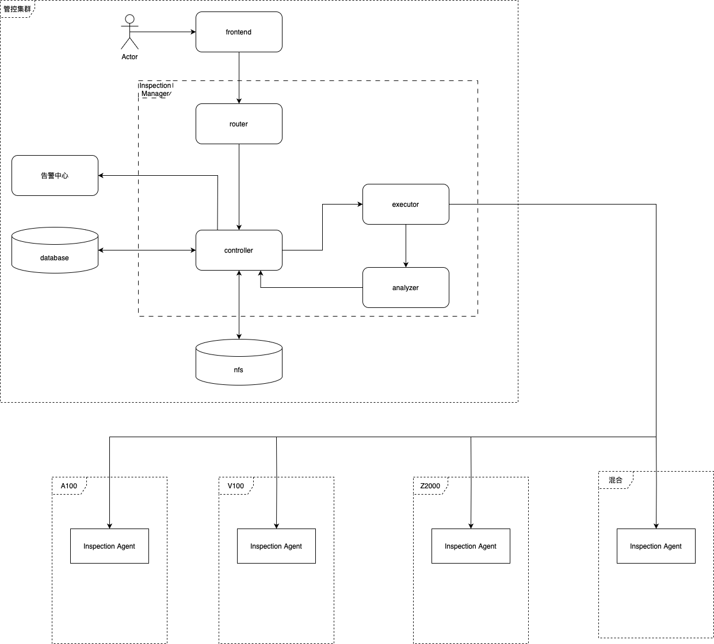

# inspection-manager
### 项目简介

在sprint1和sprint2中，健康检查所有组件放在同一个工程下，
目录为 http://10.200.93.25/infrahi/inspection/health_check

sprint3重构后，健康检查拆分为inspection-manager，inspection-agent和inspection-scripts三个部分，
其中：

inspection-manager 为健康检查的管控中心，即本工程；

inspection-agent 为作业集群的脚本执行器，路径为 http://10.200.93.25/infrahi/inspection/inspection_agent

inspection-scripts 为健康检查脚本，路径为 http://10.200.93.25/infrahi/inspection/inspection-scripts

### 更新日志
[CHANGELOG](CHANGELOG.md)

### 整体架构
健康检查系统架构图如下：



本工程为管控集群框图中虚线框内的inspection-manager。

### 开发环境配置
本工程基于beego框架开发
beego的二级制命令bee安装：

```
go install github.com/beego/bee/v2@latest
```

### 构建和运行指南
在部署时，需要在app.conf文件中指定的script_path路径下存放待执行的检查脚本。

目前测试环境和生产环境的script_path都是 /opt/inspection/scripts，可以使用如下命令下载脚本

```bash
git clone ssh://git@10.200.93.25:10022/infrahi/inspection/inspection-scripts.git
```


### 项目目录

```
├── CHANGELOG.md
├── Dockerfile
├── GIT_VERSION
├── Makefile
├── Makefile.defs
├── README.md
├── VERSION
├── api
│   └── types.go
├── build.sh
├── conf
│   └── app.conf
├── controllers
│   ├── job.go
│   ├── node.go
│   ├── script.go
│   ├── template.go
│   └── test_info.go
├── docs
│   ├── docs.go
│   ├── swagger.json
│   └── swagger.yaml
├── go.mod
├── go.sum
├── helm
│   ├── Chart.yaml
│   ├── templates
│   │   ├── _helpers.tpl
│   │   ├── clusterrole.yaml
│   │   ├── clusterrolebinding.yaml
│   │   ├── deployment.yaml
│   │   ├── ingress.yaml
│   │   ├── role.yaml
│   │   ├── rolebinding.yaml
│   │   ├── service.yaml
│   │   └── serviceaccount.yaml
│   ├── values.prod.yaml
│   └── values.test.yaml
├── img.png
├── inspection-manager
├── kube
│   ├── nanhu_gpu3_test
│   ├── nanhu_gpu4_test
│   ├── nodes.xlsx
│   ├── prod
│   ├── test
│   ├── tianqing_a100
│   ├── tianqing_test
│   ├── tianqing_zp61
│   └── zjlab_z2000
├── main.go
├── models
│   ├── job_info.go
│   ├── script.go
│   ├── template.go
│   └── test_info.go
├── pkg
│   ├── alert
│   │   ├── fault.go
│   │   └── register.go
│   ├── cluster
│   │   ├── event.go
│   │   ├── mirror.go
│   │   └── node.go
│   ├── cronjob
│   │   └── cron.go
│   ├── curl
│   │   └── call.go
│   ├── errors
│   │   └── err.go
│   ├── job
│   │   ├── manager.go
│   │   ├── processor.go
│   │   └── types.go
│   ├── proto
│   │   ├── script_transfer.pb.go
│   │   ├── script_transfer.proto
│   │   └── script_transfer_grpc.pb.go
│   ├── rpc
│   │   ├── analyzer.go
│   │   ├── client.go
│   │   └── types.go
│   ├── scripts
│   │   ├── process.go
│   │   └── scanner.go
│   └── template
│       ├── initialize.go
│       └── types.go
└── routers
    ├── commentsRouter.go
    └── router.go

```